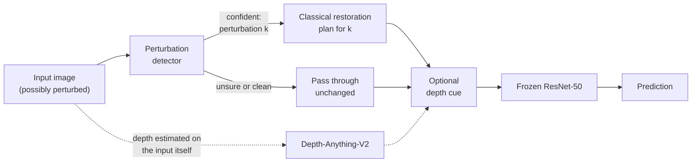
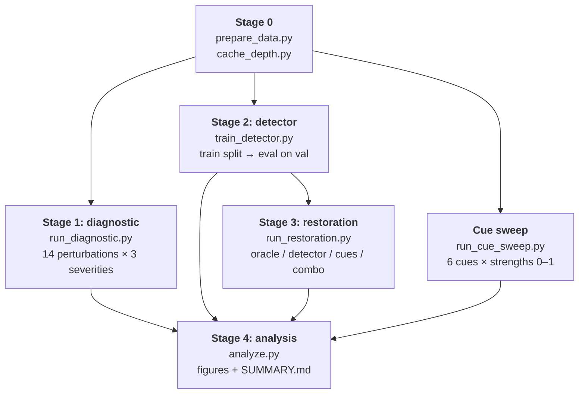
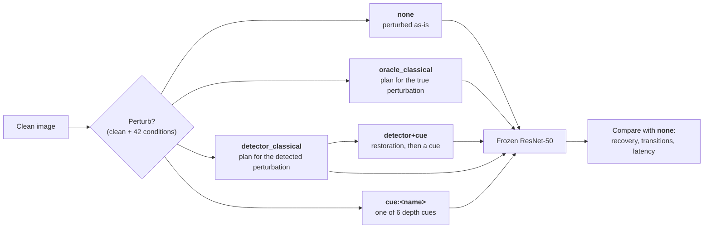

# Bolero: recovering entity context under pixel-level perturbation

CSE 598: Operationalizing Deep Learning (Fall 2026), group project.

**Team:** Rohith Khanna Sridhar, Venkat Tummala, Arvind Kaushik, Sachin Venugopalan Nair, Khushi Prashant Thakare

---

## Contents

1. [The question](#the-question)
2. [System overview](#system-overview)
3. [Pipeline stages](#pipeline-stages)
4. [Method details](#method-details)
5. [Setup](#setup)
6. [Running the pipeline](#running-the-pipeline)
7. [Outputs](#outputs)
8. [Repository layout](#repository-layout)
9. [Earlier result: the depth-layer reconstruction audit](#earlier-result-the-depth-layer-reconstruction-audit)
10. [Known gaps and limitations](#known-gaps-and-limitations)
11. [Generative AI disclosure](#generative-ai-disclosure)

---

## The question

A deployed vision model sees blurred, compressed, occluded, badly lit and noisy
images. Each of these strips out evidence the recognizer needs. We study
**disruptive but non-destructive perturbations** and ask four questions:

1. **How much recognition does a frozen classifier lose** under each perturbation, and at what severity?
2. **Can we detect the perturbation** from the image alone, without flagging clean inputs?
3. **Can lightweight preprocessing win recognition back** without retraining the classifier? We test classical restoration and depth-derived contextual cues.
4. **What does that preprocessing cost?** We measure harm on clean inputs, prediction instability and latency.

We compare methods on recognition retention and recovery, prediction stability
and added computation, with no single pass/fail threshold.

| Component | Choice |
|---|---|
| System under test | `microsoft/resnet-50`, ImageNet-1k, **frozen** (never trained or fine-tuned) |
| Depth model | `depth-anything/Depth-Anything-V2-Small-hf` (monocular relative depth) |
| Evaluation data | Imagenette2-160 validation split, 3,925 images, 10 classes |
| Detector training data | Imagenette2-160 train split (disjoint from evaluation) |

---

## System overview

We evaluate a preprocessing stage that sits in front of an unchanged classifier:



The detector is **conservative**. It sends an image to restoration when it names a
perturbation with probability of 0.6 or more (the default threshold). Anything below
that passes through untouched, so restoration can't damage a clean input that needed
no help.

Restoration never sees the clean image or its depth map. The cues re-estimate depth
on whatever image arrives, as a deployed system would have to.

---

## Pipeline stages



| Stage | Script | Question it answers | Key metrics |
|---|---|---|---|
| 0 | `prepare_data.py`, `cache_depth.py` | Is the data in place? | Image counts |
| 1 | `run_diagnostic.py` | What does each perturbation do to the classifier? | Accuracy, prediction-change rate, correct→wrong and wrong→correct counts, confidence shift, ECE, PSNR/SSIM |
| 2 | `train_detector.py` | Can the perturbation be identified from the image alone? | Top-1 detection accuracy, routed-correctly rate, clean false-alarm rate |
| 3 | `run_restoration.py` | Does preprocessing win recognition back, and at what cost? | Recovery rate, transitions vs. the perturbed input, accuracy change on clean inputs, latency |
| - | `run_cue_sweep.py` | At what strength does each cue start changing clean predictions? | Prediction-change rate vs. strength |
| 4 | `analyze.py` | Summarize everything | Figures in `results/figures/`, `results/SUMMARY.md` |

### What happens to each image in Stage 3

For each validation image, Stage 3 takes the clean image and its 42 perturbed
versions (14 perturbations × 3 severities) and runs each one through every method:



- **`oracle_classical`** sets the upper bound: the script hands it the perturbation we applied.
- **`detector_classical`** is the deployable version.
- **The `clean` rows** price a false alarm: they show what each method does to an image that needed no help.

---

## Method details

### The 14 perturbations

Defined in [`src/bolero/perturbations.py`](src/bolero/perturbations.py). Each has three
severity levels and is deterministic per (image, perturbation, level).

| Perturbation | Family | Severity levels (1 → 3) | Effect |
|---|---|---|---|
| `region_removal` | occlusion | area 0.10 / 0.20 / 0.35 | One random rectangle set to black |
| `inversion` | color | blend 0.70 / 0.85 / 1.00 | Blend toward the color negative |
| `grayscale` | color | blend 0.50 / 0.75 / 1.00 | Blend toward luminance |
| `low_contrast` | photometric | factor 0.50 / 0.30 / 0.15 | Compress around the global mean |
| `darken` | photometric | factor 0.60 / 0.40 / 0.20 | Scale intensities down |
| `brighten` | photometric | factor 0.60 / 0.40 / 0.20 | Scale toward white |
| `gaussian_blur` | blur | σ 1.0 / 2.0 / 3.5 | Whole-image blur |
| `gaussian_noise` | noise | σ 0.04 / 0.08 / 0.16 | Additive sensor-like noise |
| `jpeg_compression` | compression | quality 30 / 15 / 5 | Block artifacts |
| `boundary_blur` | boundary | top 10 / 20 / 35 % of depth edges | Blur the entity outline |
| `boundary_erase` | boundary | top 5 / 10 / 20 % of depth edges | Replace the outline with gray |
| `foreground_blur` | depth-selective | σ 2 / 4 / 6 on the nearest 40 % | Blur the entity, keep the context |
| `foreground_occlusion` | depth-selective | nearest 10 / 20 / 35 % | Gray out the entity, keep the context |
| `background_removal` | depth-selective | farthest 30 / 50 / 70 % | Gray out the context, keep the entity |

Boundary and depth-selective perturbations use the clean image's depth map to find
the entity, which makes them the adversarial half of the study. Restoration never
gets that map.

### The 6 contextual cues

Defined in [`src/bolero/cues.py`](src/bolero/cues.py) and ported from the exploratory
notebook. Every cue takes a strength in [0, 1], and strength 0 is identity.

| Cue | What it does | Default strength in Stage 3 |
|---|---|---|
| `border_strengthening` | Brightens pixels in proportion to depth-gradient strength | 0.5 |
| `depth_boundary_emphasis` | Darkens depth edges into an outline | 0.3 |
| `entity_background_separation` | Attenuates weak-structure (far, edge-free) regions | 0.3 |
| `shadow_reinforcement` | Shades far regions darker | 0.3 |
| `contrast_luminance` | CLAHE on lightness, weighted toward the near region | 0.5 |
| `thermal_injection` | Blends an inferno-colormapped depth field into RGB | 0.1 |

### Classical restoration plans

Defined in [`src/bolero/restoration.py`](src/bolero/restoration.py). There is one plan per perturbation:

| Perturbations | Restoration plan |
|---|---|
| `region_removal`, `boundary_erase`, `foreground_occlusion`, `background_removal` | Detect the constant-fill mask, then Telea inpainting |
| `low_contrast`, `darken`, `brighten` | Global auto-levels (same stretch for all channels) |
| `inversion` | Invert, then auto-levels |
| `gaussian_blur`, `boundary_blur`, `foreground_blur` | Unsharp mask |
| `gaussian_noise` | Estimate noise level, then non-local-means denoising |
| `jpeg_compression` | Bilateral filter (deblocking) |
| `grayscale` | None: color is gone, so the image passes through |

### The perturbation detector

Defined in [`src/bolero/detection.py`](src/bolero/detection.py).

- **Features:** 45 hand-crafted image statistics. They cover luminance percentiles, channel statistics, saturation, constant-fill fractions, Laplacian and gradient energy, a noise estimate, JPEG 8×8 blockiness, dark/bright-channel means, and luminance and hue histograms.
- **Model:** a random forest with 400 trees and balanced class weights. It predicts one of 15 labels: `clean` or one of the 14 perturbations.
- **Training:** perturbed copies of **train**-split images. Evaluation uses **val**-split images, so the detector never sees evaluation images.
- **Decision rule:** restore only if the top label is not `clean` and its probability is at least the threshold.

### Metrics

Defined in [`src/bolero/metrics.py`](src/bolero/metrics.py).

| Metric | Definition |
|---|---|
| Top-1 accuracy | 1000-way argmax equals the Imagenette class's ImageNet index |
| Prediction-change rate | Fraction of images whose top-1 label differs from the reference condition |
| Transitions | Counts of correct→wrong and wrong→correct vs. the reference |
| Recovery rate | (acc_restored − acc_perturbed) / (acc_clean − acc_perturbed). This is the fraction of the loss won back. |
| Confidence / true-class probability shift | Mean change in softmax confidence and in the true-class probability |
| ECE | Expected calibration error, 15 bins |
| PSNR / SSIM | Image fidelity vs. the clean image |
| Latency | Per-image milliseconds for restoration (including detection and depth) and for classification |

---

## Setup

Requires **Python 3.10+**. GPU is optional: the code selects CUDA, then Apple MPS, then CPU.

```bash
git clone https://github.com/sumonesphantom/CSE_598_ODL_project.git
cd CSE_598_ODL_project

python3 -m venv .venv && source .venv/bin/activate
pip install -r requirements.txt
pip install -e .          # optional: scripts also work without installing
```

**Data.** `prepare_data.py` looks for Imagenette2-160 in three places, in order:
`$IMAGENETTE_ROOT`, then `./data/imagenette2-160`, then
`../clip_corruption_calibration/data/imagenette2-160`. If it finds none, it
downloads the dataset (about 94 MB) into `./data`.

```bash
python scripts/prepare_data.py
# or point at an existing copy:
export IMAGENETTE_ROOT=/path/to/imagenette2-160
```

**Models.** The scripts download ResNet-50 (about 100 MB) and Depth-Anything-V2-Small
(about 100 MB) from Hugging Face on first use. Hugging Face caches them in
`~/.cache/huggingface`.

**Tests.** The 63 unit tests run on synthetic images and need no model download:

```bash
pytest
```

---

## Running the pipeline

### One command

```bash
scripts/run_all.sh quick   # 5 images/class, end-to-end, a few minutes
scripts/run_all.sh full    # all 3,925 val images for Stage 1, 50/class for Stage 3
```

### Stage by stage

```bash
python scripts/cache_depth.py                     # optional: precompute clean depth for all val images
python scripts/run_diagnostic.py                  # Stage 1 (add --per-class N to subsample)
python scripts/train_detector.py                  # Stage 2
python scripts/run_restoration.py --per-class 50  # Stage 3
python scripts/run_cue_sweep.py --per-class 50    # cue stability on clean images
python scripts/analyze.py                         # figures + results/SUMMARY.md
```

Useful flags (every script takes `--help`):

| Flag | Scripts | Purpose |
|---|---|---|
| `--per-class N` | all stages | Subsample N images per class |
| `--perturbations a b ...` | diagnostic, restoration | Run a subset of perturbations |
| `--cues a b ...` | restoration, cue sweep | Run a subset of cues |
| `--combo-cue NAME` | restoration | Cue applied after detector restoration (`none` to skip) |
| `--depth-source {perturbed,clean}` | restoration | Depth for cues: re-estimated (default) or clean-image oracle |
| `--threshold T` | train_detector | Detector confidence threshold |
| `--device {cuda,mps,cpu}` | model stages | Force a device |
| `--out DIR` | all stages | Output directory |

### Approximate runtimes (Apple M4 Pro, MPS)

| Stage | Cost | Full run |
|---|---|---|
| Clean depth, first time only | ~0.2 s / image | ~15 min for 3,925 images |
| Stage 1: diagnostic | ~0.3 s / image (42 conditions) | ~20 min for 3,925 images |
| Stage 2: detector | ~30 s at 5/class, scales linearly | a few minutes at 40/class |
| Stage 3: restoration | ~6.6 s / image (re-estimates depth for every condition) | ~55 min at 50/class |
| Cue sweep | ~0.5 s / image | ~4 min at 50/class |

---

## Outputs

```
results/
├── diagnostic/
│   ├── records.csv.gz      one row per image × perturbation × severity   (gitignored)
│   ├── summary.csv         per perturbation × severity
│   ├── per_class.csv       per perturbation × severity × class
│   └── headline.json       overall change rate and transition counts
├── detector/
│   ├── detector.joblib     fitted detector                               (gitignored)
│   ├── eval_predictions.csv                                              (gitignored)
│   ├── eval_summary.csv    per perturbation × severity detection rates
│   └── headline.json
├── restoration/
│   ├── records.csv.gz      one row per image × condition × method        (gitignored)
│   └── summary.csv         per perturbation × severity × method
├── cue_sweep/
│   ├── records.csv.gz                                                    (gitignored)
│   └── summary.csv         per cue × strength
├── figures/
│   ├── diagnostic_accuracy_change.png   accuracy change heatmap, perturbation × severity
│   ├── detector_confusion.png           true vs. predicted perturbation
│   ├── restoration_gain.png             accuracy change from each method, per perturbation
│   └── cue_sweep.png                    clean-image prediction change vs. cue strength
├── SUMMARY.md              headline numbers, tables and figures in one page
└── audit/                  outputs of notebooks/02_bolero_audit.ipynb
```

Git ignores the per-row records because the scripts regenerate them. Commit the
summaries, figures and `SUMMARY.md`; they are small.

---

## Repository layout

```
CSE_598_ODL_project/
├── src/bolero/
│   ├── config.py          paths, wnid → ImageNet index mapping, device selection
│   ├── data.py            Imagenette listing and loading
│   ├── classifier.py      frozen ResNet-50 and batched prediction
│   ├── depth.py           Depth-Anything-V2 estimator, on-disk cache, boundary / near / far masks
│   ├── perturbations.py   the 14 perturbations
│   ├── cues.py            the 6 depth-derived contextual cues
│   ├── restoration.py     classical restoration plans
│   ├── detection.py       feature extraction and the conservative detector
│   ├── metrics.py         accuracy, transitions, recovery rate, ECE, PSNR, SSIM
│   ├── records.py         prediction-table helpers
│   └── plotting.py        shared figure style (CVD-validated palette)
├── scripts/               one script per stage, plus run_all.sh
├── tests/                 unit tests on synthetic images
├── notebooks/
│   ├── 02_bolero_audit.ipynb        audit of the original reconstruction (runs end-to-end)
│   ├── 01_bolero_exploration.ipynb  original exploratory notebook (does not run; kept as a record)
│   └── 01_bolero_breakdown.ipynb
├── data/
│   ├── evidence/bolero_evidence.csv  recorded predictions used by the audit
│   └── cache/                        depth maps (gitignored)
├── results/               see "Outputs"
├── pyproject.toml
└── requirements.txt
```

---

## Earlier result: the depth-layer reconstruction audit

[`notebooks/02_bolero_audit.ipynb`](notebooks/02_bolero_audit.ipynb) audits the original
depth-layer reconstruction front-end from the recorded predictions in
`data/evidence/bolero_evidence.csv` (3,925 images).

| Metric | Original | After reconstruction |
|---|---|---|
| Top-1 accuracy | 79.4 % | 74.1 % (−5.2 pp) |
| Predictions changed | | 15.6 % |
| ECE | 0.057 | 0.073 |

English springer loses 23.3 pp while tench loses 1.6 pp. Most broken springer
predictions land on other spaniels, setters and pointers: the reconstruction keeps
the dog's silhouette and loses its coat coloration. We started the current study
from that result. A transformation can look faithful to you and still change what
the classifier sees.

> Do not use the `original_correct` / `bolero_correct` columns in that CSV.
> They compare a wnid against an ImageNet index, so only tench can ever score.
> §3 of the notebook recomputes correctness against the model's own label table.

To reproduce, open the notebook and run all cells. It writes to `results/audit/`.

---

## Known gaps and limitations

1. **We rebuilt the 14-method list from the proposal.** A teammate ran the original 122,450-record diagnostic on their own machine, and this repo doesn't have its exact definitions. If they differ, edit `PERTURBATIONS` in `src/bolero/perturbations.py`. The rest of the pipeline picks up the change.
2. **Classical restoration stays simple.** Grayscale has no classical inverse, so its plan passes the image through. A learned model, such as a colorizer or a deblurring network, would slot into `restoration.PLANS`.
3. **Nobody has tuned the denoising strength.** The NLM setting (`h = 0.9 × estimated σ`) smears natural textures, and in a 20-image run it cut accuracy on `gaussian_noise` by 30 pp.
4. **The detector misses depth-selective blur.** Blurring the foreground alone leaves global image statistics close to unchanged, and in a small run the detector flagged 5–15 % of those images.
5. **One model, one dataset.** All results are for ResNet-50 on Imagenette's 10 classes.
6. **Depth is relative.** Depth-Anything-V2 returns depth normalized per image, so "near" and "far" mean near and far within that image, in no fixed unit.

---

## Generative AI disclosure

We used AI coding assistance for the analysis code, the pipeline and the figures.
