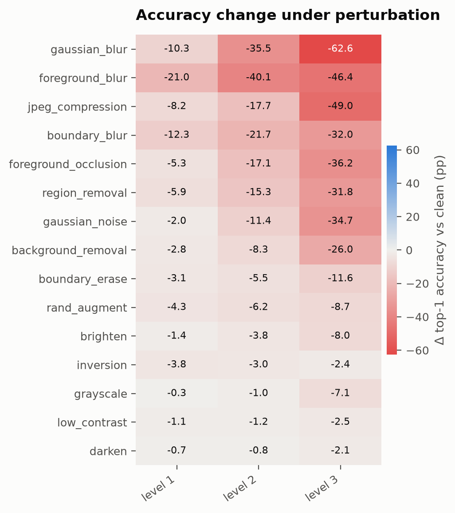
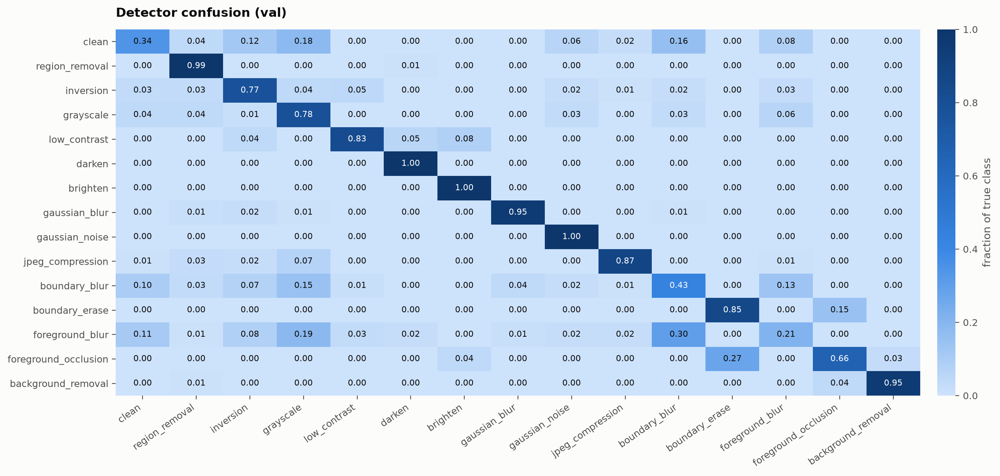
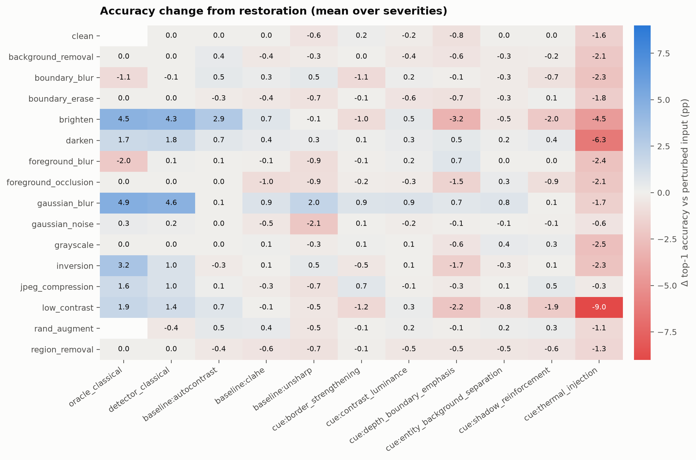
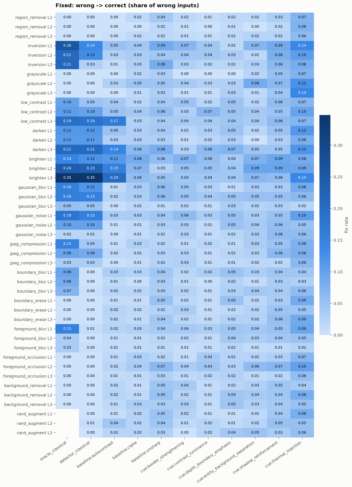
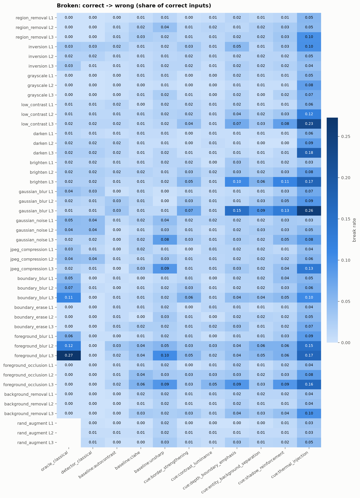
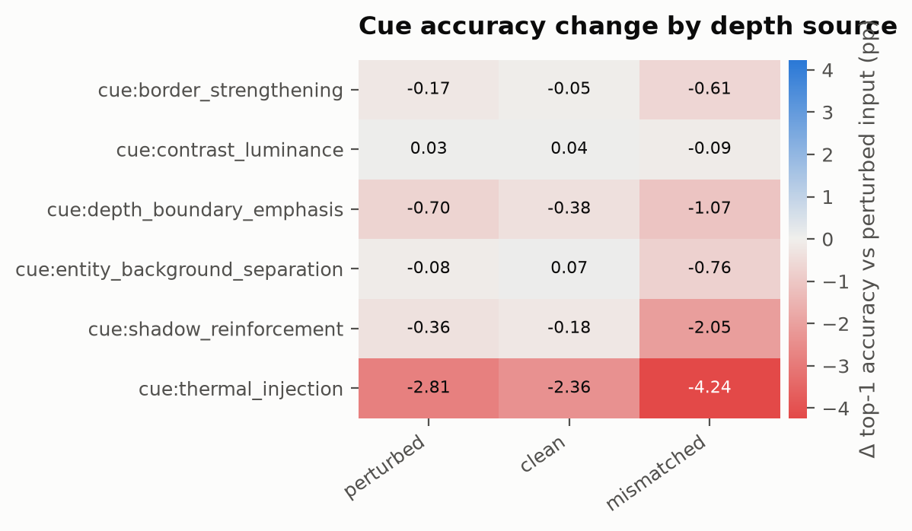
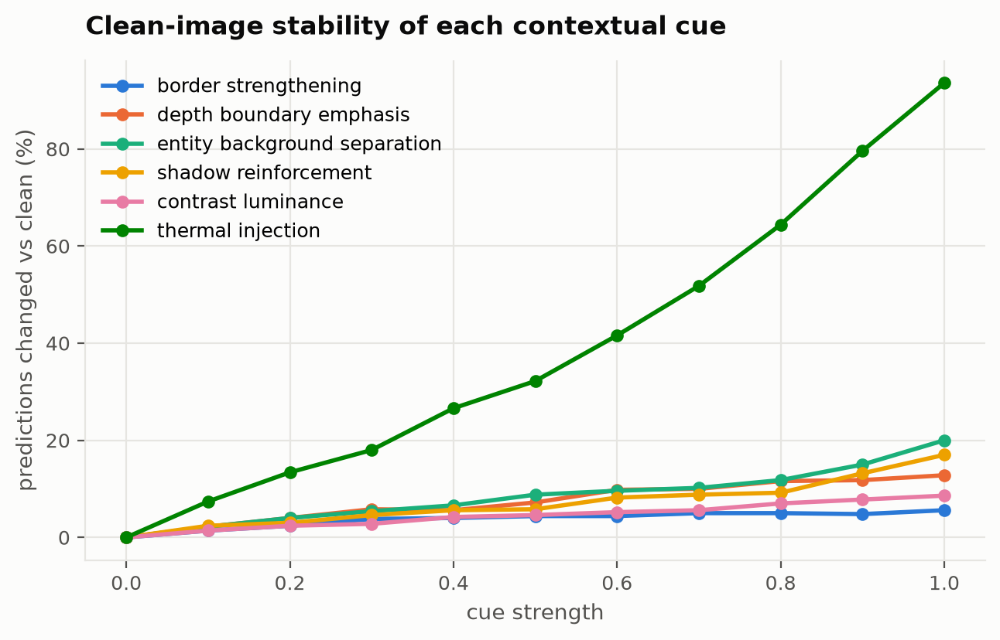

# Results summary

Generated by `scripts/analyze.py`.

## Stage 1: diagnostic sweep

- 164,850 records from 3,925 images, 14 perturbations x 3 severities
- Clean accuracy 79.4%; perturbed accuracy 64.8%
- Prediction changed in 26.23% of records; 27,445 correct->wrong, 3,386 wrong->correct

| perturbation | level | acc_pert | delta_pp | changed_rate | correct_to_wrong | wrong_to_correct | psnr | ssim |
|---|---|---|---|---|---|---|---|---|
| region_removal | 1 | 0.735 | -5.911 | 0.157 | 316.000 | 84.000 | 16.637 | 0.881 |
| region_removal | 2 | 0.641 | -15.261 | 0.282 | 693.000 | 94.000 | 13.372 | 0.770 |
| region_removal | 3 | 0.475 | -31.847 | 0.484 | 1323.000 | 73.000 | 10.764 | 0.607 |
| inversion | 1 | 0.755 | -3.822 | 0.135 | 228.000 | 78.000 | 8.211 | -0.094 |
| inversion | 2 | 0.763 | -3.032 | 0.124 | 199.000 | 80.000 | 6.524 | -0.250 |
| inversion | 3 | 0.770 | -2.395 | 0.110 | 176.000 | 82.000 | 5.113 | -0.309 |
| grayscale | 1 | 0.791 | -0.255 | 0.061 | 76.000 | 66.000 | 32.218 | 0.978 |
| grayscale | 2 | 0.783 | -1.019 | 0.084 | 116.000 | 76.000 | 28.757 | 0.961 |
| grayscale | 3 | 0.723 | -7.108 | 0.213 | 423.000 | 144.000 | 26.288 | 0.940 |
| low_contrast | 1 | 0.782 | -1.146 | 0.064 | 91.000 | 46.000 | 18.563 | 0.801 |
| low_contrast | 2 | 0.782 | -1.197 | 0.075 | 108.000 | 61.000 | 15.640 | 0.635 |
| low_contrast | 3 | 0.769 | -2.471 | 0.117 | 173.000 | 76.000 | 13.954 | 0.480 |
| darken | 1 | 0.787 | -0.662 | 0.056 | 76.000 | 50.000 | 14.035 | 0.817 |
| darken | 2 | 0.786 | -0.764 | 0.058 | 78.000 | 48.000 | 10.513 | 0.559 |
| darken | 3 | 0.772 | -2.115 | 0.100 | 153.000 | 70.000 | 8.014 | 0.247 |
| brighten | 1 | 0.780 | -1.401 | 0.081 | 113.000 | 58.000 | 12.460 | 0.746 |
| brighten | 2 | 0.756 | -3.771 | 0.117 | 210.000 | 62.000 | 8.938 | 0.598 |
| brighten | 3 | 0.714 | -8.000 | 0.190 | 380.000 | 66.000 | 6.439 | 0.428 |
| gaussian_blur | 1 | 0.690 | -10.344 | 0.219 | 498.000 | 92.000 | 27.514 | 0.869 |
| gaussian_blur | 2 | 0.438 | -35.516 | 0.529 | 1476.000 | 82.000 | 23.532 | 0.696 |
| gaussian_blur | 3 | 0.168 | -62.599 | 0.826 | 2500.000 | 43.000 | 21.214 | 0.554 |
| gaussian_noise | 1 | 0.773 | -2.038 | 0.194 | 280.000 | 200.000 | 28.241 | 0.743 |
| gaussian_noise | 2 | 0.679 | -11.414 | 0.279 | 595.000 | 147.000 | 22.393 | 0.528 |
| gaussian_noise | 3 | 0.447 | -34.675 | 0.530 | 1445.000 | 84.000 | 16.763 | 0.317 |
| jpeg_compression | 1 | 0.712 | -8.153 | 0.164 | 374.000 | 54.000 | 29.640 | 0.892 |
| jpeg_compression | 2 | 0.616 | -17.732 | 0.295 | 758.000 | 62.000 | 27.009 | 0.819 |
| jpeg_compression | 3 | 0.304 | -48.968 | 0.663 | 1958.000 | 36.000 | 22.937 | 0.663 |
| boundary_blur | 1 | 0.671 | -12.280 | 0.241 | 574.000 | 92.000 | 25.798 | 0.888 |
| boundary_blur | 2 | 0.576 | -21.732 | 0.357 | 944.000 | 91.000 | 24.573 | 0.831 |
| boundary_blur | 3 | 0.474 | -32.000 | 0.483 | 1338.000 | 82.000 | 23.603 | 0.766 |
| boundary_erase | 1 | 0.763 | -3.108 | 0.123 | 208.000 | 86.000 | 24.765 | 0.918 |
| boundary_erase | 2 | 0.739 | -5.452 | 0.164 | 315.000 | 101.000 | 21.628 | 0.852 |
| boundary_erase | 3 | 0.677 | -11.643 | 0.238 | 547.000 | 90.000 | 18.594 | 0.751 |
| foreground_blur | 1 | 0.584 | -20.968 | 0.348 | 929.000 | 106.000 | 26.873 | 0.867 |
| foreground_blur | 2 | 0.393 | -40.102 | 0.553 | 1655.000 | 81.000 | 24.079 | 0.793 |
| foreground_blur | 3 | 0.330 | -46.395 | 0.623 | 1899.000 | 78.000 | 22.718 | 0.761 |
| foreground_occlusion | 1 | 0.740 | -5.325 | 0.117 | 273.000 | 64.000 | 21.652 | 0.914 |
| foreground_occlusion | 2 | 0.622 | -17.121 | 0.264 | 744.000 | 72.000 | 18.471 | 0.833 |
| foreground_occlusion | 3 | 0.432 | -36.178 | 0.505 | 1502.000 | 82.000 | 15.867 | 0.711 |
| background_removal | 1 | 0.765 | -2.828 | 0.133 | 198.000 | 87.000 | 16.236 | 0.787 |
| background_removal | 2 | 0.711 | -8.255 | 0.224 | 425.000 | 101.000 | 14.232 | 0.652 |
| background_removal | 3 | 0.534 | -25.962 | 0.435 | 1078.000 | 59.000 | 12.767 | 0.500 |
| rand_augment | 1 | 0.751 | -4.280 | 0.134 | 252.000 | 84.000 | inf | 0.546 |
| rand_augment | 2 | 0.732 | -6.166 | 0.165 | 337.000 | 95.000 | inf | 0.476 |
| rand_augment | 3 | 0.707 | -8.688 | 0.196 | 429.000 | 88.000 | inf | 0.415 |

## Stage 2: perturbation detector

- Top-1 accuracy 83.2% over 9,000 val samples
- Clean false-alarm rate 5.5% at threshold 0.6
- Perturbed inputs routed to restoration: 72.0%

## Strength selection (development data)

Strengths were chosen on 100 `train`-split images, never on the val images used below. Rule: best mean accuracy over all perturbed conditions, among strengths that cost at most 1.0 pp on clean images.

| method | strength | acc_perturbed | gain_pp | clean_drop_pp | constraint_met |
|---|---|---|---|---|---|
| baseline:autocontrast | 0.500 | 0.625 | 0.286 | 0.000 | True |
| baseline:clahe | 0.100 | 0.619 | -0.357 | 0.000 | True |
| baseline:unsharp | 0.100 | 0.623 | 0.095 | 0.000 | True |
| cue:border_strengthening | 0.100 | 0.622 | 0.024 | -1.000 | True |
| cue:contrast_luminance | 0.200 | 0.620 | -0.190 | 0.000 | True |
| cue:depth_boundary_emphasis | 0.300 | 0.596 | -2.595 | 0.000 | True |
| cue:entity_background_separation | 0.100 | 0.625 | 0.286 | -1.000 | True |
| cue:shadow_reinforcement | 0.200 | 0.623 | 0.071 | -2.000 | True |
| cue:thermal_injection | 0.100 | 0.600 | -2.238 | -2.000 | True |

## Stage 3: restoration

Evaluated on 500 val images. Strengths: tuned.
Depth for every cue in the main results is re-estimated on the perturbed input. Accuracy, fixes and breaks are against the ground-truth label; `agree_clean_*` is agreement with the classifier's prediction on the clean image.

Row `clean` shows what each method does to unperturbed inputs (the cost of a false alarm).

Across all perturbations and severities. `back_to_clean_pred_wrong` counts images that returned to the clean prediction but are still wrong, because the clean prediction was wrong too.

| label | acc_perturbed | acc_restored | delta_pp | fix_rate | break_rate | wrong_to_correct | correct_to_wrong | agree_clean_before | agree_clean_after | back_to_clean_pred | back_to_clean_pred_wrong | restore_ms |
|---|---|---|---|---|---|---|---|---|---|---|---|---|
| oracle_classical | 0.653 | 0.663 | 1.071 | 0.075 | 0.023 | 547 | 322 | 0.748 | 0.772 | 843 | 346 | 0.616 |
| detector_classical | 0.653 | 0.663 | 1.029 | 0.050 | 0.011 | 363 | 147 | 0.748 | 0.770 | 598 | 266 | 100.932 |
| baseline:unsharp | 0.653 | 0.650 | -0.271 | 0.035 | 0.023 | 257 | 314 | 0.748 | 0.746 | 331 | 126 | 0.553 |
| baseline:autocontrast | 0.653 | 0.656 | 0.319 | 0.027 | 0.009 | 194 | 127 | 0.748 | 0.754 | 278 | 113 | 1.354 |
| baseline:clahe | 0.653 | 0.652 | -0.057 | 0.023 | 0.013 | 168 | 180 | 0.748 | 0.748 | 223 | 91 | 1.430 |
| cue:border_strengthening | 0.653 | 0.651 | -0.171 | 0.026 | 0.017 | 193 | 229 | 0.748 | 0.746 | 232 | 75 | 27.165 |
| cue:depth_boundary_emphasis | 0.653 | 0.646 | -0.695 | 0.030 | 0.027 | 222 | 368 | 0.748 | 0.740 | 295 | 118 | 27.693 |
| cue:entity_background_separation | 0.653 | 0.652 | -0.081 | 0.031 | 0.018 | 226 | 243 | 0.748 | 0.746 | 273 | 91 | 27.583 |
| cue:shadow_reinforcement | 0.653 | 0.649 | -0.357 | 0.044 | 0.029 | 318 | 393 | 0.748 | 0.741 | 375 | 124 | 26.944 |
| cue:contrast_luminance | 0.653 | 0.653 | 0.033 | 0.021 | 0.010 | 150 | 143 | 0.748 | 0.750 | 198 | 72 | 28.554 |
| cue:thermal_injection | 0.653 | 0.624 | -2.814 | 0.070 | 0.080 | 509 | 1100 | 0.748 | 0.706 | 564 | 210 | 27.470 |
| cue:border_strengthening [clean depth] | 0.653 | 0.652 | -0.052 | 0.030 | 0.017 | 219 | 230 | 0.748 | 0.746 | 250 | 68 | 0.576 |
| cue:depth_boundary_emphasis [clean depth] | 0.653 | 0.649 | -0.376 | 0.038 | 0.026 | 279 | 358 | 0.748 | 0.743 | 351 | 116 | 1.122 |
| cue:entity_background_separation [clean depth] | 0.653 | 0.653 | 0.067 | 0.037 | 0.019 | 273 | 259 | 0.748 | 0.747 | 315 | 91 | 1.005 |
| cue:shadow_reinforcement [clean depth] | 0.653 | 0.651 | -0.176 | 0.053 | 0.031 | 388 | 425 | 0.748 | 0.744 | 457 | 136 | 0.374 |
| cue:contrast_luminance [clean depth] | 0.653 | 0.653 | 0.038 | 0.021 | 0.011 | 156 | 148 | 0.748 | 0.749 | 199 | 71 | 1.981 |
| cue:thermal_injection [clean depth] | 0.653 | 0.629 | -2.362 | 0.080 | 0.079 | 587 | 1083 | 0.748 | 0.710 | 621 | 188 | 0.891 |
| cue:border_strengthening [mismatched depth] | 0.653 | 0.646 | -0.614 | 0.034 | 0.027 | 245 | 374 | 0.748 | 0.736 | 256 | 83 | 0.571 |
| cue:depth_boundary_emphasis [mismatched depth] | 0.653 | 0.642 | -1.071 | 0.042 | 0.039 | 307 | 532 | 0.748 | 0.727 | 304 | 93 | 1.105 |
| cue:entity_background_separation [mismatched depth] | 0.653 | 0.645 | -0.757 | 0.036 | 0.031 | 263 | 422 | 0.748 | 0.735 | 288 | 97 | 0.993 |
| cue:shadow_reinforcement [mismatched depth] | 0.653 | 0.632 | -2.048 | 0.046 | 0.056 | 336 | 766 | 0.748 | 0.721 | 400 | 161 | 0.369 |
| cue:contrast_luminance [mismatched depth] | 0.653 | 0.652 | -0.090 | 0.019 | 0.011 | 136 | 155 | 0.748 | 0.748 | 187 | 70 | 1.961 |
| cue:thermal_injection [mismatched depth] | 0.653 | 0.610 | -4.238 | 0.068 | 0.101 | 499 | 1389 | 0.748 | 0.683 | 464 | 179 | 0.880 |
| detector+cue:border_strengthening | 0.653 | 0.664 | 1.124 | 0.068 | 0.019 | 494 | 258 | 0.748 | 0.768 | 702 | 281 | 128.076 |
| detector+cue:depth_boundary_emphasis | 0.653 | 0.658 | 0.505 | 0.066 | 0.027 | 480 | 374 | 0.748 | 0.762 | 710 | 292 | 128.602 |
| detector+cue:entity_background_separation | 0.653 | 0.664 | 1.114 | 0.070 | 0.020 | 510 | 276 | 0.748 | 0.768 | 733 | 278 | 128.493 |
| detector+cue:shadow_reinforcement | 0.653 | 0.661 | 0.876 | 0.076 | 0.027 | 558 | 374 | 0.748 | 0.763 | 775 | 290 | 127.876 |
| detector+cue:contrast_luminance | 0.653 | 0.662 | 0.957 | 0.060 | 0.018 | 441 | 240 | 0.748 | 0.768 | 672 | 288 | 129.467 |
| detector+cue:thermal_injection | 0.653 | 0.647 | -0.505 | 0.094 | 0.058 | 684 | 790 | 0.748 | 0.743 | 880 | 347 | 128.368 |

On clean inputs:

| label | delta_pp_vs_clean | changed_rate | correct_to_wrong | wrong_to_correct |
|---|---|---|---|---|
| detector_classical | 0.000 | 0.000 | 0 | 0 |
| baseline:unsharp | -0.600 | 0.020 | 5 | 2 |
| baseline:autocontrast | 0.000 | 0.010 | 2 | 2 |
| baseline:clahe | 0.000 | 0.020 | 3 | 3 |
| cue:border_strengthening | 0.200 | 0.014 | 2 | 3 |
| cue:depth_boundary_emphasis | -0.800 | 0.020 | 5 | 1 |
| cue:entity_background_separation | 0.000 | 0.018 | 2 | 2 |
| cue:shadow_reinforcement | 0.000 | 0.026 | 3 | 3 |
| cue:contrast_luminance | -0.200 | 0.014 | 3 | 2 |
| cue:thermal_injection | -1.600 | 0.056 | 14 | 6 |
| cue:border_strengthening [clean depth] | 0.200 | 0.014 | 2 | 3 |
| cue:depth_boundary_emphasis [clean depth] | -0.800 | 0.020 | 5 | 1 |
| cue:entity_background_separation [clean depth] | 0.000 | 0.018 | 2 | 2 |
| cue:shadow_reinforcement [clean depth] | 0.000 | 0.026 | 3 | 3 |
| cue:contrast_luminance [clean depth] | -0.200 | 0.014 | 3 | 2 |
| cue:thermal_injection [clean depth] | -1.600 | 0.058 | 14 | 6 |
| cue:border_strengthening [mismatched depth] | 0.400 | 0.016 | 1 | 3 |
| cue:depth_boundary_emphasis [mismatched depth] | -0.200 | 0.040 | 6 | 5 |
| cue:entity_background_separation [mismatched depth] | 0.400 | 0.022 | 2 | 4 |
| cue:shadow_reinforcement [mismatched depth] | -1.200 | 0.046 | 10 | 4 |
| cue:contrast_luminance [mismatched depth] | -0.200 | 0.010 | 2 | 1 |
| cue:thermal_injection [mismatched depth] | 0.200 | 0.056 | 9 | 10 |
| detector+cue:border_strengthening | 0.200 | 0.014 | 2 | 3 |
| detector+cue:depth_boundary_emphasis | -0.600 | 0.018 | 4 | 1 |
| detector+cue:entity_background_separation | 0.000 | 0.018 | 2 | 2 |
| detector+cue:shadow_reinforcement | 0.000 | 0.026 | 3 | 3 |
| detector+cue:contrast_luminance | 0.000 | 0.012 | 2 | 2 |
| detector+cue:thermal_injection | -1.800 | 0.060 | 15 | 6 |

### Held-out stress test

Perturbations never seen by the detector or strength tuning (rand_augment). They are excluded from the pooled table above. There is no oracle plan for them.

| perturbation | label | acc_perturbed | acc_restored | delta_pp | fix_rate | break_rate |
|---|---|---|---|---|---|---|
| rand_augment | detector_classical | 0.731 | 0.727 | -0.400 | 0.002 | 0.006 |
| rand_augment | baseline:unsharp | 0.731 | 0.726 | -0.533 | 0.040 | 0.022 |
| rand_augment | baseline:autocontrast | 0.731 | 0.736 | 0.467 | 0.025 | 0.003 |
| rand_augment | baseline:clahe | 0.731 | 0.735 | 0.400 | 0.022 | 0.003 |
| rand_augment | cue:border_strengthening | 0.731 | 0.731 | -0.067 | 0.012 | 0.005 |
| rand_augment | cue:depth_boundary_emphasis | 0.731 | 0.730 | -0.133 | 0.022 | 0.010 |
| rand_augment | cue:entity_background_separation | 0.731 | 0.733 | 0.200 | 0.030 | 0.008 |
| rand_augment | cue:shadow_reinforcement | 0.731 | 0.734 | 0.267 | 0.042 | 0.012 |
| rand_augment | cue:contrast_luminance | 0.731 | 0.733 | 0.200 | 0.017 | 0.004 |
| rand_augment | cue:thermal_injection | 0.731 | 0.720 | -1.133 | 0.062 | 0.038 |

Fixes and breaks by perturbation and severity (per-condition counts are in `restoration/summary.csv`):

### Does the depth map matter?

Each cue with depth re-estimated on the perturbed input (deployable), the clean image's depth (idealized) and an unrelated image's depth (control). If `mismatched` matches `perturbed`, the cue's effect does not come from depth information.

| method | perturbed | clean | mismatched |
|---|---|---|---|
| cue:border_strengthening | -0.171 | -0.052 | -0.614 |
| cue:contrast_luminance | 0.033 | 0.038 | -0.090 |
| cue:depth_boundary_emphasis | -0.695 | -0.376 | -1.071 |
| cue:entity_background_separation | -0.081 | 0.067 | -0.757 |
| cue:shadow_reinforcement | -0.357 | -0.176 | -2.048 |
| cue:thermal_injection | -2.814 | -2.362 | -4.238 |

### Components: detector restoration alone vs. followed by each cue

| label | acc_restored | delta_pp | fix_rate | break_rate |
|---|---|---|---|---|
| detector_classical | 0.663 | 1.029 | 0.050 | 0.011 |
| detector+cue:border_strengthening | 0.664 | 1.124 | 0.068 | 0.019 |
| detector+cue:depth_boundary_emphasis | 0.658 | 0.505 | 0.066 | 0.027 |
| detector+cue:entity_background_separation | 0.664 | 1.114 | 0.070 | 0.020 |
| detector+cue:shadow_reinforcement | 0.661 | 0.876 | 0.076 | 0.027 |
| detector+cue:contrast_luminance | 0.662 | 0.957 | 0.060 | 0.018 |
| detector+cue:thermal_injection | 0.647 | -0.505 | 0.094 | 0.058 |

### Do failures coincide with unreliable depth?

Depth reliability is the Spearman correlation between depth estimated on the perturbed input and on the clean image (quartile bins over all perturbed inputs).

| depth_bin | acc_perturbed | n |
|---|---|---|
| (-0.911, 0.928] | 0.581 | 5250 |
| (0.928, 0.978] | 0.628 | 5250 |
| (0.978, 0.995] | 0.672 | 5250 |
| (0.995, 1.0] | 0.729 | 5250 |

| method | depth_rank_corr | n | fix_rate | break_rate | delta_pp |
|---|---|---|---|---|---|
| cue:border_strengthening | (-0.911, 0.928] | 5250 | 0.023 | 0.019 | -0.133 |
| cue:border_strengthening | (0.928, 0.978] | 5250 | 0.027 | 0.020 | -0.267 |
| cue:border_strengthening | (0.978, 0.995] | 5250 | 0.030 | 0.015 | -0.057 |
| cue:border_strengthening | (0.995, 1.0] | 5250 | 0.027 | 0.013 | -0.229 |
| cue:contrast_luminance | (-0.911, 0.928] | 5250 | 0.015 | 0.012 | -0.076 |
| cue:contrast_luminance | (0.928, 0.978] | 5250 | 0.018 | 0.010 | 0.019 |
| cue:contrast_luminance | (0.978, 0.995] | 5250 | 0.019 | 0.012 | -0.190 |
| cue:contrast_luminance | (0.995, 1.0] | 5250 | 0.035 | 0.008 | 0.381 |
| cue:depth_boundary_emphasis | (-0.911, 0.928] | 5250 | 0.027 | 0.030 | -0.629 |
| cue:depth_boundary_emphasis | (0.928, 0.978] | 5250 | 0.033 | 0.029 | -0.590 |
| cue:depth_boundary_emphasis | (0.978, 0.995] | 5250 | 0.027 | 0.024 | -0.705 |
| cue:depth_boundary_emphasis | (0.995, 1.0] | 5250 | 0.037 | 0.025 | -0.857 |
| cue:entity_background_separation | (-0.911, 0.928] | 5250 | 0.028 | 0.022 | -0.095 |
| cue:entity_background_separation | (0.928, 0.978] | 5250 | 0.027 | 0.021 | -0.286 |
| cue:entity_background_separation | (0.978, 0.995] | 5250 | 0.031 | 0.016 | -0.076 |
| cue:entity_background_separation | (0.995, 1.0] | 5250 | 0.040 | 0.013 | 0.133 |
| cue:shadow_reinforcement | (-0.911, 0.928] | 5250 | 0.037 | 0.035 | -0.495 |
| cue:shadow_reinforcement | (0.928, 0.978] | 5250 | 0.037 | 0.033 | -0.705 |
| cue:shadow_reinforcement | (0.978, 0.995] | 5250 | 0.044 | 0.033 | -0.781 |
| cue:shadow_reinforcement | (0.995, 1.0] | 5250 | 0.062 | 0.015 | 0.552 |
| cue:thermal_injection | (-0.911, 0.928] | 5250 | 0.061 | 0.068 | -1.410 |
| cue:thermal_injection | (0.928, 0.978] | 5250 | 0.065 | 0.079 | -2.571 |
| cue:thermal_injection | (0.978, 0.995] | 5250 | 0.071 | 0.087 | -3.505 |
| cue:thermal_injection | (0.995, 1.0] | 5250 | 0.087 | 0.084 | -3.771 |

## Cue strength sweep (clean images)

Fraction of predictions changed vs. the clean image:

| strength | border_strengthening | contrast_luminance | depth_boundary_emphasis | entity_background_separation | shadow_reinforcement | thermal_injection |
|---|---|---|---|---|---|---|
| 0.000 | 0.000 | 0.000 | 0.000 | 0.000 | 0.000 | 0.000 |
| 0.100 | 0.014 | 0.014 | 0.022 | 0.022 | 0.024 | 0.074 |
| 0.200 | 0.024 | 0.024 | 0.040 | 0.040 | 0.030 | 0.134 |
| 0.300 | 0.038 | 0.028 | 0.058 | 0.054 | 0.046 | 0.180 |
| 0.400 | 0.040 | 0.042 | 0.056 | 0.066 | 0.056 | 0.266 |
| 0.500 | 0.044 | 0.046 | 0.072 | 0.088 | 0.058 | 0.322 |
| 0.600 | 0.044 | 0.052 | 0.098 | 0.096 | 0.082 | 0.416 |
| 0.700 | 0.050 | 0.056 | 0.100 | 0.102 | 0.088 | 0.518 |
| 0.800 | 0.050 | 0.070 | 0.116 | 0.118 | 0.092 | 0.644 |
| 0.900 | 0.048 | 0.078 | 0.118 | 0.150 | 0.132 | 0.796 |
| 1.000 | 0.056 | 0.086 | 0.128 | 0.200 | 0.170 | 0.936 |
